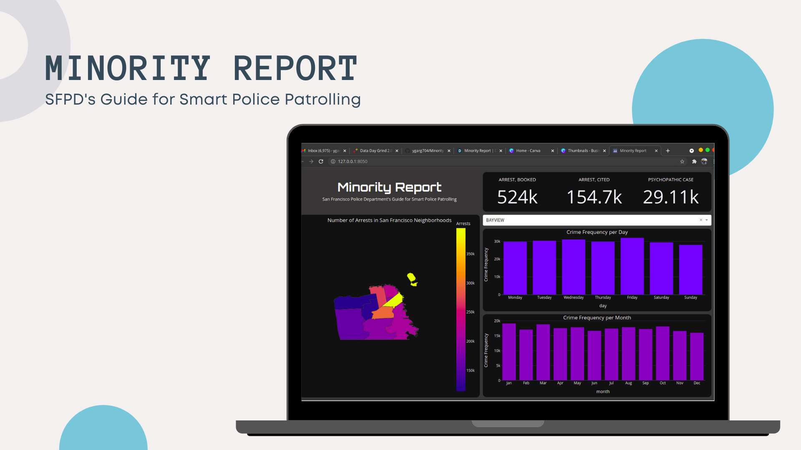

# Minority Report

For Data Day Grind 2.0!

Access the Dashboard [here](https://minorityreport-sf.herokuapp.com/)

## Video Walkthrough

For a detailed video walkthrough for the application and analysis, click [here]()

## Inspiration

In urban areas, crime and disorder have been long-lasting problems. They spoil the economic and emotional well-being of residents. Approximately 70% of the world's population will soon live in urban areas. As cities grow, so increases the complexity and management challenges for government authorities. They have to deal with the various urban problems that arise due to high population density. Cities play a vital role in looking for ways to achieve more efficient management of infrastructures, and address challenges of development, sustainability, and inclusion. Some cities are addressing these challenges by Smart City initiatives.

These initiatives focus on how cities can transform themselves in different policy areas such as crime reduction. A significant way to detect crime and maintain public safety is through police patrolling. Minority Report is an interactive machine learning-based live dashboard that can help SFPD with Smart Police Patrolling. This application is not limited to law enforcement officers. The general population of the city can also utilize this application or dashboard to stay informed of criminal activities, which in turn, will keep them protected.

## What it does

Recently, patrol planning and other predictive policing strategies were improved for Smart Cities applications. In such public safety context, some police departments have been recording crime events in their databases to compose better strategies to understand and predict crime incidence. Minority Report explores the use of Machine Learning (Classification Algorithms and Artificial Neural Network) algorithms to predict crime levels in different districts of San Francisco at any given day and time, using records of criminal activities past logged in by the SFPD. Based on the exploratory data analysis and machine learning model, a dashboard has been developed in order to monitor the said criminal situation around San Francisco.

## Application Framework

1. **Data Collection & Pre-processing:** The dataset was taken from San Francisco’s Government website. It contains police department incident reports from the year 2003 to 2018 (May). The original dataset, at the time of model creation, had 2,160,953 rows and 35 columns. In the first step of the Data Cleaning pipeline, I removed the null values from the dataset, followed by the unwanted columns that don’t add enough inference to the model. After the wanted columns were removed, time and date columns were merged to aid model creation. All the preprocessing was executed using NumPy and pandas library of python.

2. **Grouping:** Crime occurrence frequency in each district was calculated given the day, month, and hour. These occurrences were distributed from 0 to 400 across all districts reflecting the high variation that time and location have on the frequency of crimes. The data was converted into quartiles. Furthermore, the dataset was grouped into four quartiles, ‘Low’, ‘Medium’, ‘High’, and ‘Extreme’. Using quartiles for classifying a specific day and region into these categories provides an easy human-interpretable way to examine the crime occurrences and frequency. Each quartile has approximately 5000 values. This data was further used in classification.

3. **Machine Learning:** First, I ran some classification algorithms on our dataset like Logistic Regression, K Nearest Neighbour, Decision Tree, Random Forest with GridSearchCV, and XG Boost. Using Keras, with a TensorFlow backend, a feedforward neural network was also developed. With trial and error, I adjusted the number and details of the various layers of the network.

4. **Dashboard:** Plotly (Dash) was used to develop the dashboard. It's hosted on the Heroku server with styling done using HTML, CSS components of Dash. For the whole project, python language was used because of the high availability of libraries and packages.

## Future Scope

- An automated warning system to alert nearby patrolling squads about possible criminal activities in the area.
- A two-way feedback system from the personnel about the criminal activities will continuously improve the model’s performance.
- Other possible conditions to make an even more robust crime rate predictive model. Incorporating factors like unemployment levels, weather conditions, electric black-outs, etc, all of which couldn’t be sourced in a reliable database for the city of San Francisco at the time of developing this application.

## Requirements

- Python 3.7+
- Pip Package Manager
- Jupyter Notebook & VS Code editor (not mandatory)

## Instructions
